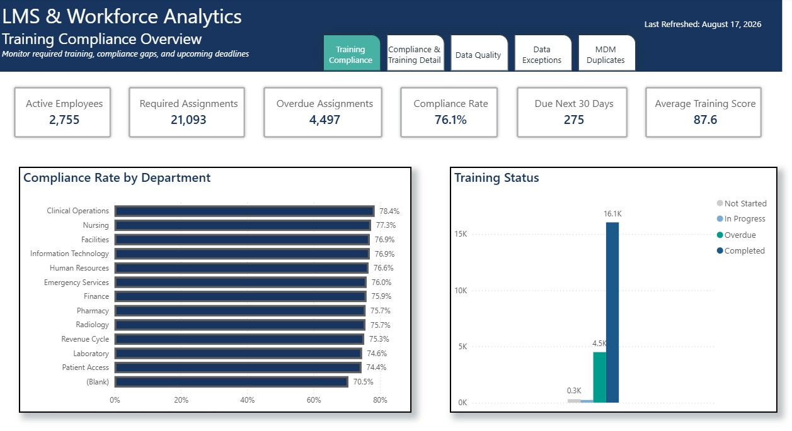
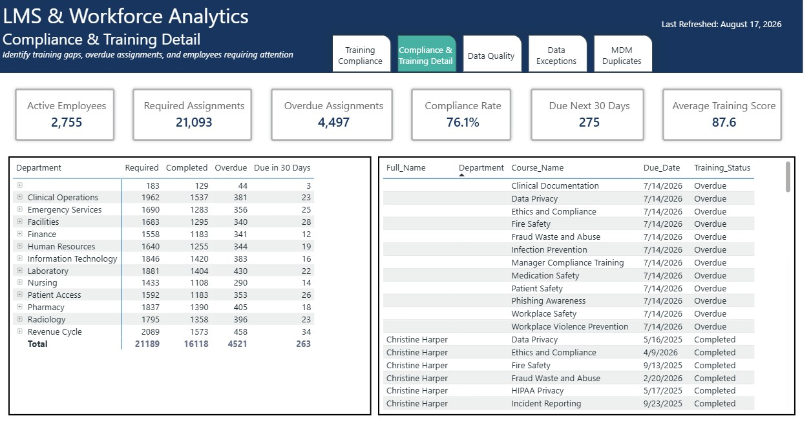
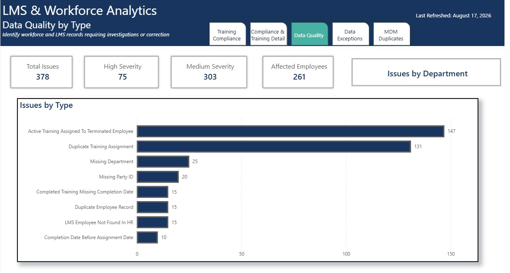
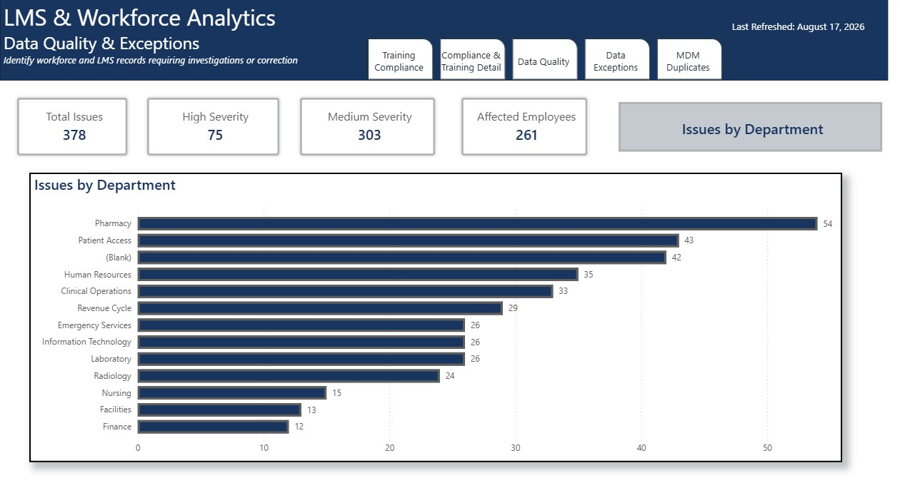
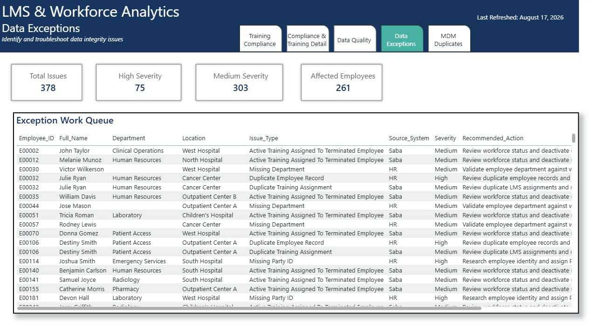
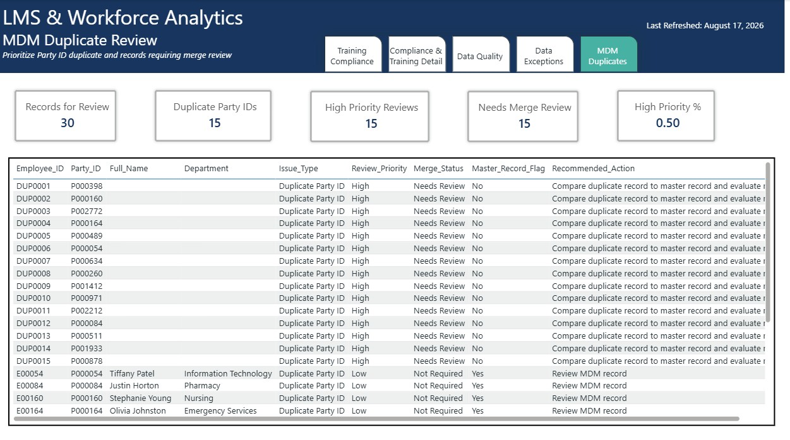

# LMS-Workforce_Compliance

This project demonstrates how HR and Learning Management System data can be transformed into actionable reporting.

**Power BI | SQL Server | SQL | DAX | Python | Data Quality | MDM**

An end-to-end healthcare workforce and Learning Management System (LMS) analytics project designed to demonstrate reporting, training compliance monitoring, data-quality validation, Master Data Management (MDM), and operational analytics.

> **Data Disclaimer:** All data used in this project is synthetic and was created solely for portfolio and demonstration purposes. No real employee, patient, healthcare organization, LMS, or confidential business data is included.

---

## 📌 Project Overview

I developed this **LMS & Workforce Compliance Analytics** project to demonstrate how HR and Learning Management System data can be transformed into actionable reporting for training compliance, workforce operations, data quality, and Master Data Management.

The project simulates a healthcare training and workforce reporting environment and focuses on real-world reporting activities such as:

- Monitoring required training compliance
- Identifying overdue and upcoming training
- Investigating cross-system data discrepancies
- Detecting missing and duplicate records
- Reviewing duplicate Party IDs
- Supporting MDM merge workflows
- Maintaining recurring weekly reporting
- Providing operational work queues for analysts

Rather than building Power BI visuals directly from raw files, the project uses a multi-layer reporting architecture:

**Python → SQL Server → SQL Reporting Views → Data Validation → Historical Snapshots → Power BI**

---

## 🎯 Business Problem

HR, workforce, and training teams need reliable information to answer questions such as:

- What is the current required-training compliance rate?
- Which employees, departments, locations, or courses require attention?
- How much training is overdue?
- What training is approaching its due date?
- Are LMS records consistent with workforce data?
- Which records contain missing, duplicate, or invalid information?
- Which MDM Party IDs require duplicate or merge review?
- How is training compliance changing over time?

The goal of this project was to create a reporting solution that supports both **leadership-level monitoring** and **analyst-level investigation**.

---

## 🛠️ Technology Stack

| Technology | Purpose |
|---|---|
| **Python** | Generated synthetic HR, LMS, course, and MDM datasets |
| **SQL Server / SSMS** | Data storage, transformation, validation, and reporting |
| **SQL** | Joins, aggregations, data-quality rules, views, and troubleshooting |
| **SQL Views** | Created reporting-ready datasets for Power BI |
| **SQL History Table** | Preserved recurring compliance snapshots |
| **Power BI** | Data modeling, DAX, visualization, filtering, and reporting |
| **DAX** | Dynamic KPIs, compliance calculations, and exception metrics |

---

## 🏗️ Solution Architecture

```text
Synthetic Data Generation
        │
        ▼
      Python
        │
        ▼
    CSV Files
        │
        ▼
   SQL Server
        │
        ├── HR Workforce Data
        ├── LMS Training Assignments
        ├── Course Catalog
        └── MDM Party ID Data
        │
        ▼
 SQL Reporting Layer
        │
        ├── Employee Training
        ├── Training Compliance
        ├── Data Quality Exceptions
        ├── MDM Duplicate Review
        └── Weekly Compliance
        │
        ▼
Historical Compliance Snapshots
        │
        ▼
     Power BI
        │
        ├── Compliance Overview
        ├── Training Detail
        ├── Data Quality
        ├── MDM Review
        └── Report Documentation
```

---

## 🗄️ SQL Reporting Layer

Rather than recreating business logic inside individual Power BI visuals, I developed SQL views to provide purpose-built reporting datasets.

### `vw_EmployeeTraining`

Detailed employee-level LMS reporting dataset combining workforce, course, and training assignment information.

Supports analysis by:

- Employee
- Department
- Location
- Course
- Course category
- Training status
- Due date
- Required training
- Training score
- Employment status

---

### `vw_TrainingCompliance`

Aggregated training-compliance reporting view supporting:

- Required assignments
- Employee counts
- Completed training
- Overdue training
- In-progress training
- Not-started training
- Training due within 30 days
- Average training scores
- Compliance rate

This view provides a reporting-ready dataset for executive and operational Power BI reporting.

---

### `vw_DataQualityIssues`

Consolidated exception dataset designed to identify data-quality problems across HR and LMS systems.

Validation rules include:

- Missing Party IDs
- Missing departments
- Duplicate employee records
- LMS employees not found in HR
- Duplicate training assignments
- Completed training with missing completion dates
- Completion dates occurring before assignment dates
- Active LMS assignments associated with terminated employees

Each exception includes:

- Employee information
- Issue type
- Source system
- Severity
- Recommended action

This allows the Power BI report to function as an **operational exception-management work queue**, rather than simply displaying issue counts.

---

### `vw_MDM_DuplicateReview`

Operational Master Data Management work queue designed to support Party ID duplicate and merge investigation.

The view includes:

- Employee ID
- Party ID
- Employee information
- Duplicate indicators
- Merge status
- Master-record indicators
- Party ID record count
- Review priority
- Issue classification
- Recommended action

This provides analysts with a prioritized dataset for investigating potential duplicate identities and merge candidates.

---

### `vw_WeeklyCompliance`

Recurring compliance reporting dataset summarizing required training for active employees.

Metrics include:

- Employee count
- Required assignments
- Completed assignments
- Overdue assignments
- In-progress assignments
- Not-started assignments
- Due within 30 days
- Average score
- Compliance rate

---

### `Weekly_Compliance_History`

A physical SQL table is used to preserve compliance snapshots over time.

Unlike a SQL view that represents the current state, the history table allows the reporting solution to retain previous snapshots for historical analysis.

This supports:

- Week-over-week compliance analysis
- Historical overdue trends
- Compliance improvement monitoring
- Recurring reporting
- Power BI trend visualization

---

## 📊 Power BI Report

The final Power BI solution contains **six report pages, including one hidden supporting page**.

The report was designed with a consistent enterprise-style layout, page navigation, KPI cards, analytical visuals, operational work queues, and documentation.








---
### 1️⃣ Training Compliance Overview
**Purpose:** Monitor required training, compliance gaps, and upcoming deadlines
Provides an executive-level view of workforce training compliance.

#### Key KPIs

- Active Employees
- Required Assignments
- Overdue Assignments
- Compliance Rate
- Due Next 30 Days
- Average Training Score

#### Analysis

The page also provides visibility into:

- Compliance Rate by department
- Training status
---

### 2️⃣ Compliance & Training Detail

**Purpose:** Identify training gaps, overdue assignments, and employees requiring attention.

This page provides drill-down analysis from:

**Department → Course → Employee**

Key metrics include:

- Active Employees
- Required Assignments
- Overdue Assignments
- Compliance Rate
- Due Next 30 Days
- Average Training Score

The page allows analysts to move from high-level compliance results to the specific courses and employees driving compliance gaps.

---

### 3️⃣ Data Quality 
**Purpose:** Identify workforce and LMS records requiring investigations or correction.


#### Key KPIs

- Total Issues
- High Severity
- Medium Severity
- Affected Employees

#### Analysis

Issues can be analyzed by:

- Issue by Type
- Issue by Department

---

### 4️⃣ Data Exceptions
**Purpose:** Identify and troubleshooting data integrity issues.

#### Key KPIs

- Total Issues
- High Severity
- Medium Severity
- Affected Employees

#### Analysis

A detailed **Exception Work Queue** provides the individual records requiring investigation and the recommended action for each issue.

---

### 5️⃣ MDM Duplicate Review
**Purpose:** Prioritize Party ID duplicate and records requiring merge review

#### Key KPIs

- Records for Review
- Duplicate Party IDs
- High Priority Reviews
- Needs Merge Review
- High Priority %

#### Analysis

A detailed **MDM Review Work Queue** provides detailed records for analyst follow-up.

---

## 🔢 Example DAX Measures

### Compliance Rate

```DAX
Compliance Rate =
DIVIDE(
    [Completed Assignments Count],
    [Required Assignments Count],
    0
)
```

### Affected Employees

```DAX
Affected Employees =
CALCULATE(
    DISTINCTCOUNT(vw_DataQualityIssues[Employee_ID]),
    NOT ISBLANK(vw_DataQualityIssues[Employee_ID])
)
```

### High Priority MDM Reviews

```DAX
High Priority Reviews =
CALCULATE(
    COUNTROWS(vw_MDM_DuplicateReview),
    vw_MDM_DuplicateReview[Review_Priority] = "High"
)
```

### Overdue Assignments

```DAX
Overdue Assignments Count =
CALCULATE(
    COUNT(vw_EmployeeTraining[Assignment_ID]),
    vw_EmployeeTraining[Required_Flag] = TRUE(),
    vw_EmployeeTraining[Employment_Status] = "Active",
    vw_EmployeeTraining[Training_Status] = "Overdue"
)
```

---

## 🔍 Data Quality Approach

Data quality was intentionally treated as part of the reporting architecture rather than as a separate cleanup exercise.

The workflow follows this pattern:

```text
Source Record
     │
     ▼
SQL Validation Rule
     │
     ▼
Exception Identified
     │
     ├── Issue Type
     ├── Source System
     ├── Severity
     └── Recommended Action
     │
     ▼
Power BI Exception Work Queue
     │
     ▼
Analyst Investigation
```

This approach turns data-quality reporting into an actionable operational process.

---

## 🔄 Recurring Reporting Approach

The project also demonstrates how recurring weekly reporting can be separated from current-state reporting.

```text
Current LMS / HR Data
        │
        ▼
vw_WeeklyCompliance
        │
        ▼
Weekly Snapshot Process
        │
        ▼
Weekly_Compliance_History
        │
        ▼
Power BI Historical Analysis
```

This architecture allows historical metrics to remain available even as the underlying operational data changes.

---

## 💡 Skills Demonstrated

This project demonstrates experience with:

### Power BI

- Dashboard and report development
- DAX measures
- KPI development
- Matrix and table reporting
- Conditional formatting
- Drill-down analysis
- Report navigation
- Operational dashboard design

### SQL

- SQL Server
- Joins
- Aggregations
- CASE expressions
- Data validation
- SQL views
- Window functions
- Duplicate detection
- Cross-system reconciliation
- Historical snapshot tables
- Recurring reporting logic

### Data Analysis

- Training compliance analysis
- Workforce reporting
- Data-quality monitoring
- Root-cause investigation
- Exception management
- MDM duplicate analysis
- Trend analysis

### Reporting & Documentation

- Business definitions
- Reporting requirements
- Process documentation
- KPI definitions
- Technical-to-business communication

---

## 🎯 Key Takeaway

This project reinforced that effective business intelligence involves much more than creating visualizations.

A reliable dashboard depends on the work performed before the first visual is created:

**Understanding the business requirement → identifying the correct data → validating records → establishing business rules → creating reusable reporting datasets → calculating meaningful metrics → presenting actionable insights.**

The Power BI dashboard is the presentation layer of a much larger reporting process.

---

## 🔐 Data Disclaimer

All data contained in this repository and displayed in the Power BI report is **synthetic** and was generated solely for portfolio and educational purposes.

No real employee, patient, healthcare organization, LMS, or confidential business information is included.

---

## 👤 Author

**Catherine McKillips**

Business Intelligence / Data Analyst

**Core Tools:** Power BI • SQL • SQL Server • Python • Excel • Data Quality • Business Intelligence
